---

toc: True
layout: post
data: tools
title: KASM Workspace Operating System and Tools Setup
description: Setup guide for using the Ubuntu-based KASM Workspace for development.
categories: ['DevOps']
author: Lily Wu
permalink: /tools/os/kasm
breadcrumb: True 
---

## Installation Hack

Welcome to your journey of setting up your Operating System and Tools! This setup process will guide you through working in a Linux terminal, managing folders, cloning a project, and adding packages.

## Visual Representation of the Workflow

```mermaid
flowchart TD
    A["💻 Open Terminal"] 
    B["> Linux Commands<br>mkdir, cd, ls"]
    C["📁 Clone Project<br>git clone https://<your-repo>"]
    D["🛠️ Activate Tools<br>Ruby, Python, Git"]
    E["🔄 SDLC<br>code->make->test->commit"]

    A --> B --> C --> D --> E
```



## Shell Commands

* KASM (Linux): `ls`, `pwd`, `mkdir`, `cd`, `git`, `cat`

## Version Control Commands

* **git clone**: Make a working copy of a git repository from the cloud to your local machine.
* **git pull**: Update your local copy of the repository with changes from the cloud repository.
* **git commit**: Save changes to files in your local repository.
* **git push**: Send updates from your local repository to the remote repository.

## Package Manager Commands – Ubuntu (apt)

* **Update package list:** `sudo apt update`
* **Upgrade installed packages:** `sudo apt upgrade`
* **Install a package:** `sudo apt install <package_name>`
* **Remove a package:** `sudo apt remove <package_name>`
* **Search for a package:** `apt search <package_name>`
* **List installed packages:** `apt list --installed`

---

## KASM Workspace Setup (Ubuntu Noble / Kali)

Thanks to improvements in the KASM image, getting started is fast and simple.

Open a Terminal

### First-time setup

```bash
mkdir opencs
cd opencs
git clone https://github.com/Open-Coding-Society/student.git
cd student/
./scripts/activate.sh # prompts for Git UID and Personal Email
./scripts/venv.sh
code .
```

---

### Version Checks (Optional)

Open a new Terminal

```bash
python --version
pip --version
ruby -v
bundle -v
gem --version
git config --global --list
```

#### Starting a session to work in VSCode

Open a new Terminal

Each time you open a new Terminal to work, run:

```bash
cd opencs/student
source venv/bin/activate # activate Python virtual environment
code .
```

---


