## Installation Hack

Welcome to your journey of setting up your Operating System and Tools! This setup process will guide you through working in a Linux terminal, managing folders, cloning a project, and adding packages. This is a fundamental skill for any developer or cyber security expert.

## Visual Representation of the Workflow

```mermaid
flowchart TD
    A["💻 Open Terminal"] 
    B["> Linux Commands<br>mkdir, cd, ls"]
    C["📁 Clone Project<br>git clone https://<your-repo>"]
    D["🛠️ Activate Tools<br>Ruby, Python, Git"]
    E["🔄 SDLC<br>code->make->test->commit"]

    A --> B --> C --> D --> E
```



## Shell Commands

You’ll use standard Unix shell commands:

- MacOS: `ls`, `pwd`, `mkdir`, `cd`, `git`, `cat`

## Version Control Commands

- **git clone**: Make a working copy of a git repository from the cloud to your local machine.
- **git pull**: Update your local copy of the repository with changes from the cloud repository.
- **git commit**: Save changes to files in your local repository.
- **git push**: Send updates from your local repository to the remote repository.

## Package Manager Commands – MacOS (brew)

- **List installed packages:** `brew list`
- **Search for a package:** `brew search <package_name>`
- **Update Homebrew:** `brew update`
- **Upgrade installed packages:** `brew upgrade`
- **Uninstall a package:** `brew uninstall <package_name>`

---

## MacOS Setup

### 1. Install Homebrew

Open a MacOS **Terminal** (keep it in the Dock for easy access).  
Follow the instructions on [Homebrew Install](https://brew.sh/).  

### 2. Install VS Code

Download and install [VS Code](https://code.visualstudio.com/download) for Mac.  

### 3. First-time Setup

⚠️ Run these commands **one line at a time** in Terminal.

```bash
mkdir opencs
cd opencs
git clone https://github.com/Open-Coding-Society/student.git
cd student/
./scripts/activate_macos.sh
./scripts/activate.sh # prompts for Git UID and Personal Email
./scripts/venv.sh
```

#### Setup Checks (Optional)

Open a new MacOS "terminal" by clicking Terminal Icon in Dock

You can always come back to these checks later if your tools stop working.

```bash
python --version
pip --version
ruby -v
bundle -v
gem --version
git config --global --list
```

#### Starting a session to work in VSCode

Open a new MacOS "terminal"

Each time you open a new Terminal to work, run:

```bash
cd opencs/student
source venv/bin/activate # activate Python virtual environment
code .
```

---


