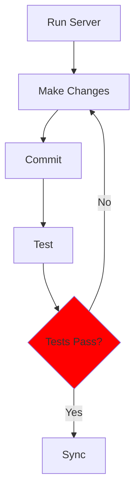

## Starting a Project

The following commands are universal for all machine types, terminals, and projects. The previous installation steps ensured that all machine types have compatible tools. Follow these steps in order:

### Open a Linux-supported Terminal (Ubuntu, Kali, MacOS).

### Setup a directory for projects

Change **opencs and open-coding-society/student.git** to match the name of your organization and repo.

   ```bash
   cd # move to your home directory
   mkdir -p opencs # use your organization, not opencs
   cd opencs # user your oganization, noot opencs
   git clone https://github.com/open-coding-society/student.git # clone from your organization, not open-code-society
   ```

### Prepare project prior to opening VS Code

   ```bash
   cd student # Move to your personal project directory
   ./scripts/venv.sh # Activate the virtual environment (observe the prompt change)
   source venv/bin/activate # Prefix (venv) in path
   bundle install # Ensure Ruby gems for GitHub Pages is installed in (venv)
   code . p # Open the project in VS Code
   ```

### Authenticate with GitHub

* At some point, you may be prompted to authenticate with GitHub. Follow the dialog and instructions.

### For WSL Users Only

* Ensure that VS Code is opened in WSL. Check the bottom-left corner of the VS Code window to confirm. This is critical for success!
   

---

## Software Development Life Cycle (SDLC)

The development cycle involves iterative steps of running the server, making changes, testing, committing, and syncing changes to GitHub. This process ensures that your website is updated and functioning correctly both locally and on GitHub Pages.

### SDLC Workflow

```text
+-------------------+       +-------------------+       +-------------------+       +-------------------+       +-------------------+
|                   |       |                   |       |                   |       |                   |       |                   |
|    Run Server     | ----> |   Make Changes    | ----> |     Commit        | ----> |      Test         | ----> |     Sync          |
|                   |       |                   |       |                   |       |                   |       |                   |
+-------------------+       +-------------------+       +-------------------+       +-------------------+       +-------------------+
        |                           |                           |                           |                           |
        v                           v                           v                           v                           v
 Start Local Server           Edit Code Files             Save Changes Locally         Verify Changes           Push Changes to Remote
```

### Open Project and Make

All students are building a GitHub Pages website.  These steps get your website running on your desktop (local or cloud).

#### What is `make`?

Think of `make` as a smart **task helper** for developers.

* It **automates commands** you would normally type one by one.
* It starts a **localhost server** on you machine, enabling Testing prior to Sync.
* It reads a special file called a **Makefile**, which lists tasks and how to run them.  

Simply run:

```bash
make
```

And it will do everything listed in the `Makefile`.

1. Open a terminal

2. Navigate to your project directory

3. Activate virtual environment (venv) `source venv/bin/activate`

4. Open VSCode `code .`

5. Open a VSCode Terminal

6. Type `make` This runs a build to a local server. Repeat this command as often as you make changes.

7. Hover then Cmd or Ctl Click on the Server address **<http://127.0.0.1> ...** provided in the terminal output from the make command.

```bash
### Congratulations!!! An output similar to below means tool and equipment success ###
johnmortensen@Johns-MBP pages % make
Stopping server...
Stopping logging process...
Starting server...
Server PID: 48190
Terminal logging starting, watching server...
Server started in 3 seconds
Configuration file: /Users/johnmortensen/vscode/pages/_config.yml
To use retry middleware with Faraday v2.0+, install `faraday-retry` gem
            Source: /Users/johnmortensen/vscode/pages
       Destination: /Users/johnmortensen/vscode/pages/_site
 Incremental build: disabled. Enable with --incremental
      Generating... 
      Remote Theme: Using theme jekyll/minima
                    done in 2.493 seconds.
 Auto-regeneration: enabled for '/Users/johnmortensen/vscode/pages'
    Server address: http://127.0.0.1:4100/pages/
```

#### Make workflow (local build: make, make clean, make stop, make convert)

These commands are used to build and manage a localhost version of the website. The purpose of this is to verify and test code changes prior to pushing changes to GitHub Pages.

* `make`: Runs the local server.

* `make clean`: Stops the local server and cleans the build files. Try this after rename as it could cause duplicates in build.

* `make stop`: Stops the local server. This means you will be unable to access your blog on <http://localhost> until you run `make` again.

* `make convert`: Converts Jupyter Notebook files. Run this if your `.ipynb` files are not updating on the server; it may assist in finding the error.

### VSCode Commit and Sync Workflow

All students will be writing and changing code.  These steps allow you to change the website, first locally and then on public location.

```text
+-------------------+       +-------------------+       +-------------------+       +-------------------+
|                   |       |                   |       |                   |       |                   |
|   VS Code Editor  | ----> |   Local Git Repo  | ----> |   Remote GitHub   | ----> |   GitHub Pages    |
|                   |       |                   |       |                   |       |                   |
+-------------------+       +-------------------+       +-------------------+       +-------------------+
        |                           |                           |                           |
        |                           |                           |                           |
        v                           v                           v                           v
    Save Files                Commit Changes               Sync Changes                Public Website
   Local Website
```

#### Detailed SDLC Steps

The SDLC adds the important steps of Make and Test to the workflow. This ensures that you **never** sync code that is broken locally. This helps the developer troubleshoot errors early and as you are working.

1. Save Files in VS Code:

   * Edit your files.
   * Save the changes (Cmd + S on Mac or Ctrl + S on Windows/Linux).
   * Verify changes on the local web server.

2. Commit Changes in VS Code:

   * Click on the "Source Control" icon in the left sidebar.
   * Stage your changes by clicking the plus sign next to the files.
   * Enter a commit message.
   * Click the "Commit" button.

3. Test Changes on Local Server:

   * Open Terminal.
   * Be sure the "(venv)" prefix is in the prompt.
   * Type `make` in the prompt (run `make`).
   * If successful, you will see log output in the prompt:

   ```text
   Stopping server...
   Stopping logging process...
   Detected theme: minima
   Will call: serve-minima
   Stopping server...
   Stopping logging process...
   Starting server with Minima theme...
   Server PID: 57693
   Server started in 17 seconds
    Server address: http://127.0.0.1:4500/
   ```

   * If delayed open 2nd terminal an run command `cat \tmp\jekyl4500.log`.  The log shoown is if things are right.

   ```text
   Configuration file: /Users/johnmortensen/open/pages/_config.yml
   To use retry middleware with Faraday v2.0+, install `faraday-retry` gem
               Source: /Users/johnmortensen/open/pages
         Destination: /Users/johnmortensen/open/pages/_site
   Incremental build: disabled. Enable with --incremental
         Generating... 
         Remote Theme: Using theme jekyll/minima
   ```

   * Open the localhost Server address in deskop or cloud computer browser `http://127.0.0.1:4500/`
   * Test your changes before you commit.
   * If there are errors, make adjustments, commit, and run make again.

4. Sync Changes to GitHub:

   * Never sync changes before you test, as this activates Actions on GitHub.
   * Click the "Sync Changes" button in the Source Control view.
   * This pushes your local commits to the remote GitHub repository.

5. Update GitHub Pages:

   * GitHub Pages Action automatically rebuilds your site with the latest changes.
   * Visit your public website at https://<yourGitHubID>.github.io/student to see the updates.


