---

toc: True
layout: post
data: tools
title: Windows (WSL) Operating System and Tools Setup
description: Setup guide for using Windows Subsystem for Linux with Ubuntu for development.
categories: ['DevOps']
author: Lily Wu
permalink: /tools/os/windows
breadcrumb: True 
---

## Installation Hack

Welcome to your journey of setting up your Operating System and Tools! This setup process will guide you through working in a Linux terminal, managing folders, cloning a project, and adding packages.

## Visual Representation of the Workflow

```mermaid
flowchart TD
    A["💻 Open Windows Terminal"] 
    A1["💻 Install WSL<br>wsl --install"] 
    A2["💻 Launch Ubuntu Terminal<br>wsl"]
    B["📁 Linux Commands<br>mkdir, cd, ls"]
    C["📁 Clone Project<br>git clone https://<your-repo>"]
    D["🛠️ Activate Tools<br>Ruby, Python, Git"]
    E["🔄 SDLC<br>code → make → test → commit"]

    A --> A1 --> A2 --> B --> C --> D --> E
```



## Shell Commands

- Windows: `wsl`, then standard Linux commands inside Ubuntu

## Version Control Commands

- **git clone**: Make a working copy of a git repository from the cloud to your local machine.
- **git pull**: Update your local copy of the repository with changes from the cloud repository.
- **git commit**: Save changes to files in your local repository.
- **git push**: Send updates from your local repository to the remote repository.

## Package Manager Commands – Ubuntu (apt)

- **Update package list:** `sudo apt update`
- **Upgrade installed packages:** `sudo apt upgrade`
- **Install a package:** `sudo apt install <package_name>`
- **Remove a package:** `sudo apt remove <package_name>`
- **Search for a package:** `apt search <package_name>`
- **List installed packages:** `apt list --installed`

---

## Windows Setup

### Install VSCode

[VSCode link, Select OS and select default on prompts](https://code.visualstudio.com/download)

### Install Git Config Manager (GCM)

[Git Config Manager and select default on prompts](https://git-scm.com/downloads/win)

### WSL common commands

- `wsl --help`, `wsl -l -o`, `wsl -l -v`, `wsl --shutdown`, `wsl --uregister`

### WSL install

1. Open Windows Terminal and Pin to Taskbar. All of these commands are activated from Windows Shell (`C:\`)

   ```bash
   wsl --install -d Ubuntu-24.04
   ```

2. Setup a username and password when prompted. On password you will be typing but will not see respones.

3. At the conclusion of the install you will receive a WSL Ubuntu prompt.  For now we will exit WSL.

   ```bash
   exit
   ```

4. Set as default:  

   ```bash
   wsl --set-default Ubuntu-24.04
   ```

5. To start WSL Ubuntu from (`C:\`)

   ```bash
   wsl
   ```

6. Close Terminal.

---

## WSL Ubuntu Setup

### First-time Setup

Open Terminal by right clicking on Terminal in Taskbar and selecting Ubuntu 24.04

Run these commands to set up your Ubuntu developer tools for the first time.

```bash
mkdir opencs
cd opencs
git config --global credential.helper "/mnt/c/Program\ Files/Git/mingw64/bin/git-credential-manager.exe"
git clone https://github.com/Open-Coding-Society/student.git
cd student/
./scripts/activate_ubuntu.sh # prompts for your recently created WSL Ubuntu password
./scripts/activate.sh # prompts for Git UID and Personal Email
./scripts/venv.sh
```

#### System Checks (Optional)

Open Terminal by right clicking on Terminal in Taskbar and selecting Ubuntu 24.04

Run these commands to verify your system setup and check installed tools.

```bash
python --version
pip --version
ruby -v
bundle -v
gem --version
git config --global --list
```

#### Restarting a terminal

Open Terminal by right clicking on Terminal in Taskbar and selecting Ubuntu 24.04

Each time you open a new terminal session, run these commands to activate your environment and start working on the student project in VS Code.

```bash
cd opencs/student
source venv/bin/activate
code .
```

---


