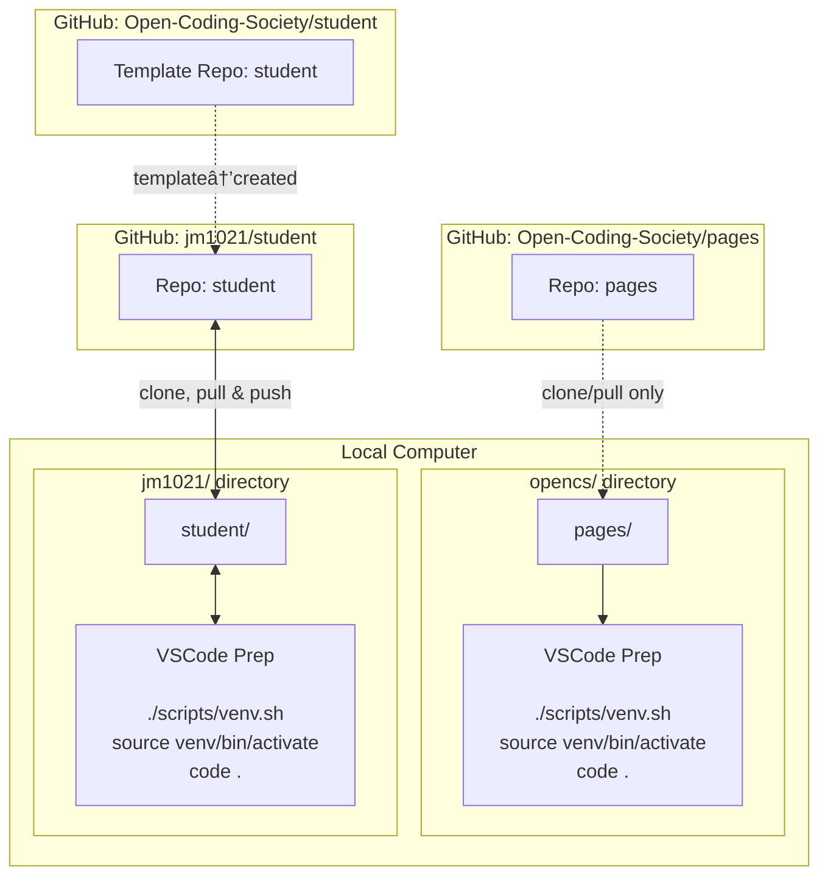

## Visual Journey

Linux is the most compatible OS for Developers.  

This visual help remind me of Tools and their relationship to my Development Journey. 

```mermaid
flowchart TD
    %% GitHub Sources
    subgraph GitHub_Pages[GitHub: Open-Coding-Society/pages]
        A[Repo: pages]:::repo
    end

    subgraph GitHub_Template[GitHub: Open-Coding-Society/student]
        T[Template Repo: student]:::repo
    end

    subgraph GitHub_Student[GitHub: jm1021/student]
        B[Repo: student]:::repo
    end

    %% Local Computer
    subgraph Local[Local Computer]
        subgraph opencs_dir[opencs/ directory]
            C[pages/]:::local
            Ccmd[VSCode Prep<br/><br/>./scripts/venv.sh<br/>source venv/bin/activate<br/>code .]:::cmd
        end
        subgraph user_dir[jm1021/ directory]
            D[student/]:::local
            Dcmd[VSCode Prep<br/><br/>./scripts/venv.sh<br/>source venv/bin/activate<br/>code .]:::cmd
        end
    end

    %% Arrows: cloning
    A -.->|clone/pull only| C
    B <--> |clone, pull & push| D

    %% Arrows: template relationship
    T -.->|template→created| B

    %% Arrows: commands
    C --> Ccmd
    D <--> Dcmd

```